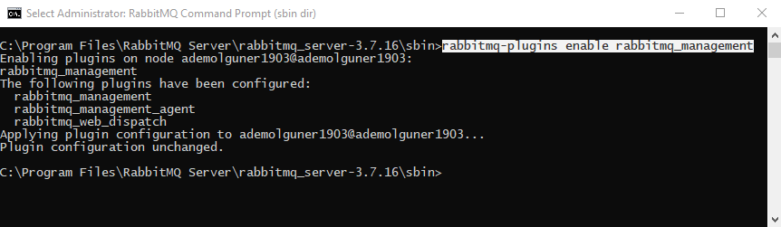
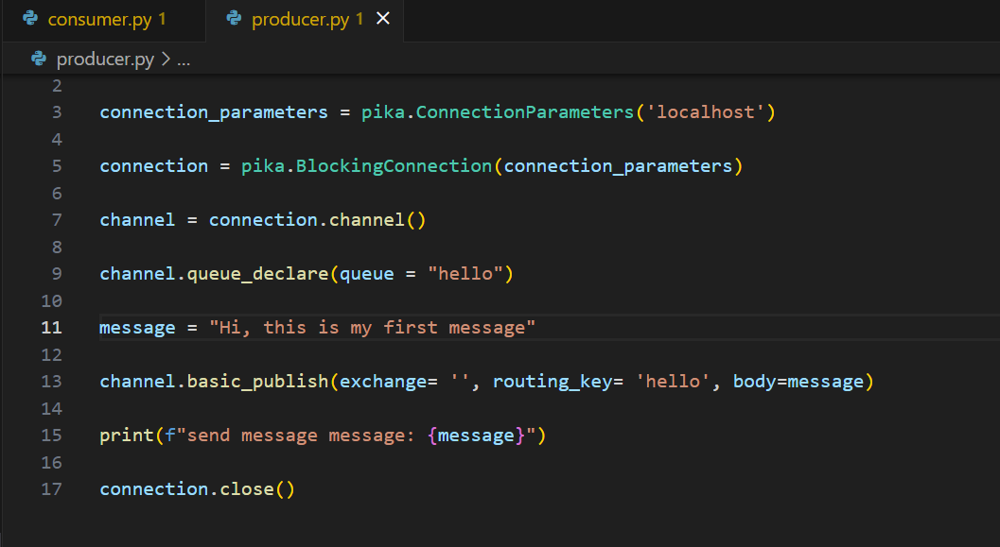
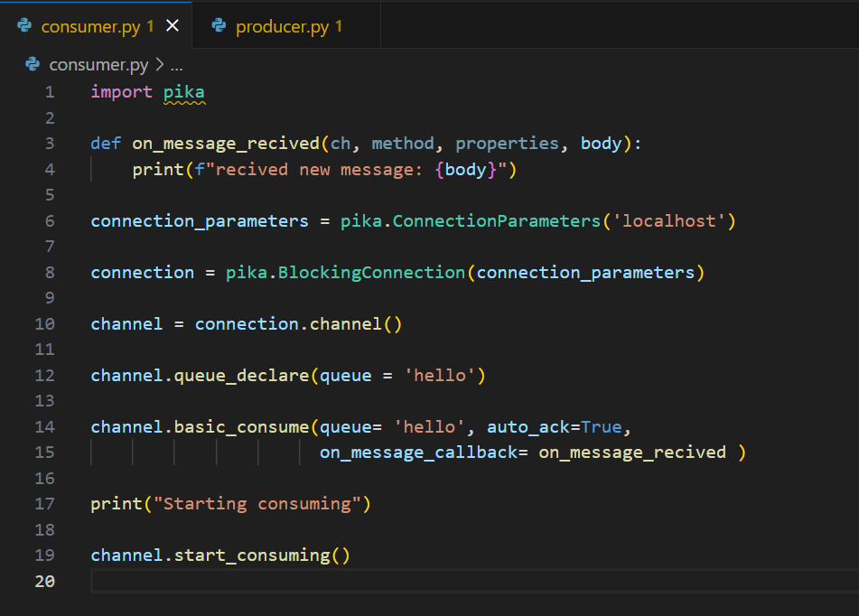

# RabbitMQ 

## RabbitMQ Kurulumu

RabbitMQ Erlang programlama dilinde geliştirilmiştir. Bu nedenle RabbitMQ kurulurken ilk adım olarak Erlang programlama dili için kurulum yapılır. Ardından RabbitMQ kurulur.
 	
  İlk olarak https://www.erlang.org/downloads adresinden indirilen exe dosyası ile erlang kurulumu yapılır.
  
 	Erlang kurulumu tamamlandıktan sonra https://www.rabbitmq.com/docs/download adresinden bilgisayara uygun olarak RabbitMQ kurulumu yapılır.

## RabbitMQ Konfigürasyon

Konfigürasyon işlemi için Windows tuşuna basıp arama kısmına “RabbitMQ Command Prompt” yazarak arama yapılır. 

 

RabbitMQ Command Prompt’a tıklanır. Aşağıdaki ekran elde edilir:

RabbitMQ kurulumlarından sonra RabbitMQ Plugin-Servisini aktif etmek için komut satırı dizesine alttaki komutu yazalım ve Servis-Plugin’i aktifleştirilmiş olur.
 

Kurulum ve konfigürasyon işlemlerini tamamlandıktan sonra RabbitMQ için browser’a 15672 portundan erişilebilir.

http://localhost:15672

 

Karşımıza local makinemize kurmuş olduğumuz RabbitMQ login ekranı gelecektir. RabbitMQ kurulumunda varsayılan olarak kullanıcı adı ve şifre tanımlanmış olarak gelir.

UserName: guest
Password : guest

## Python ile İlk Kullanım Örneği

Python ile publisher olarak mesaj göndermek ve gelen mesajı consumer olarak almak için gereken kodlar ve adım adım yapılması gerekenler aşağıdaki gibidir:

* İlk olarak producer.py ve consumer.py olarak adlandırılan  publisher ve consumer  için python kodu yazılır. 

  

  

 * http://localhost:15672 adresine gidilerek RabbitMQ Management’a giriş yapılır. Varsayılan olarak kullanıcı adı ve şifre = guest şeklindedir.

    

 * Python kodları yazıldıktan  sonra kullanılan IDE’ye ait terminal ya da bilgisayarın komut istemi kullanılarak producer.py içerisine yazılan producer kodu çalıştırılır.
  
    

 * 	Producer.py kodu çalıştırıldıtan sonra RabbitMQ Management’te elde edilen çıktı aşağıdaki gibidir.
 
  
  
 * Bu işlemlerin ardından Consumer kodu çalıştırılır. 

 

 * Consume işleminden sonra RabbitMQ Management görünümü aşağıdaki gibidir.

 
